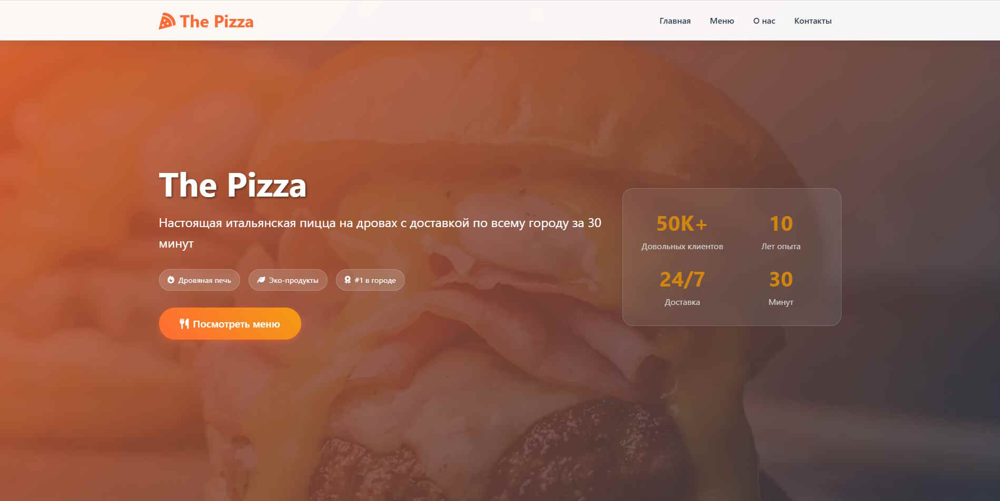
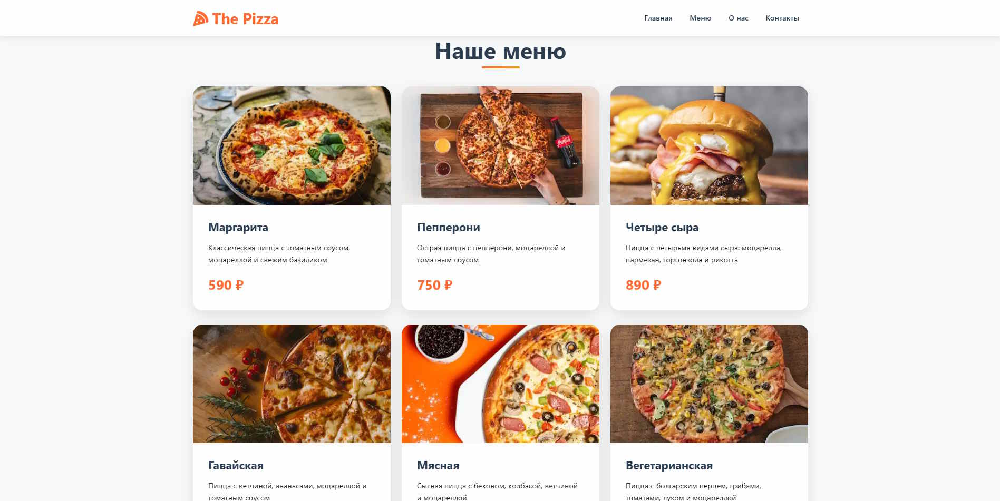
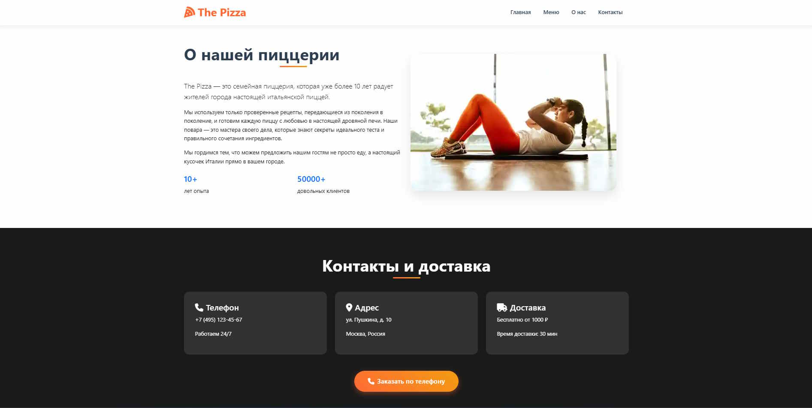

# The Pizza - Сайт пиццерии



Одностраничный сайт пиццерии "The Pizza" с информацией о меню, доставке и контактах.

## Описание проекта


Этот сайт представляет собой современный адаптивный лендинг для пиццерии, который включает:
- Главную страницу с информацией о заведении
- Раздел меню с фотографиями и описанием пицц
- Информацию о компании
- Контактные данные и условия доставки

## Использованные технологии



### Основные технологии
- **HTML5** - семантическая разметка страницы
- **CSS3** - стилизация элементов
- **JavaScript** - интерактивные элементы и анимации

### Фреймворки и библиотеки
- **Bootstrap 5** - адаптивная сетка и компоненты
- **Font Awesome** - иконки
- **Intersection Observer API** - анимации при скролле



### Особенности реализации
- Полностью адаптивный дизайн (mobile-first подход)
- Плавная прокрутка к разделам
- Анимации элементов при появлении в области видимости
- Фиксированная навигационная панель с изменением прозрачности
- Оптимизированная загрузка изображений

## Установка и запуск

Клонировать репозиторий:
   ```bash
   git clone https://github.com/BagmanG/Pizza-Landing.git